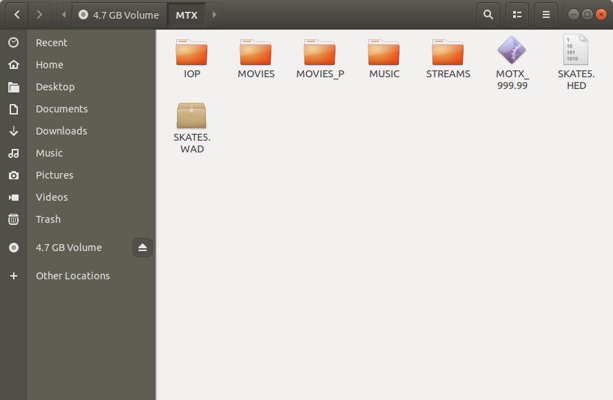
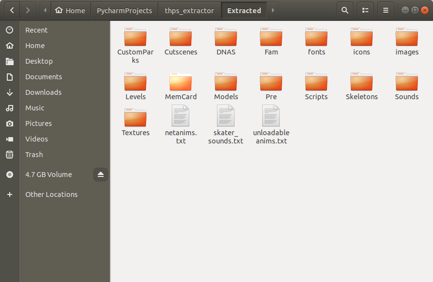

# Tony Hawk's Underground (THUG) Asset Extractor

> A Python 3 application for unpacking Tony Hawk's Underground .WAD files.

This Python application extracts all game assets from Tony Hawk's Underground (THUG)  .WAD files. The .WAD files are binary files that Neversoft stored assets in for games built on it's Big Guns engine. I was interested in learning more about this game's file structure for an unrelated project and found that there were few existing tools to extract these assets. The tools that did exist also had minor flaws in how they determined file length which had potential to extract corrupt files. I reverse engineered the file structures and was able to decode the fields in the .HED file, which gave me a table of contents for the .WAD file.

## Prerequisites:

##### Python 3.7 +

I built this app using only the default libraries provided by Python 3.7, no other libraries are needed

##### SKATE5.WAD

##### SKATE5.HED

These two files can be found on the root folder of the THUG disc. There is another set of files with the same name located in the MTX folder that appear to be leftover from an early version of the game. This extractor will work on those files as well as all other .HED and .WAD files on the disk. I did not have a chance to test it with the Xbox or Gamecube versions but I believe it will work with those as well.

I did not include the files or any assets owned by Neversoft in this repo. These files can be found on any retail copy of THUG. The easiest platform to extract these files from is the PS2 version as it can be read by any DVD drive. Gamecube and Xbox disc formats cannot be read in DVD drives without firmware modifications.


_Root directory of Tony Hawk's Underground for PS2_


_Files extracted when run on the .HED and .WAD in the MTX directory_

## Running:

The app requires the location to the .HED and .WAD files passed as positional command line arguments. Here's an example of how to run:

```shell
python3 thug_wad_extractor.py /home/Documents/SKATE5.HED /home/Documents/SKATE5.WAD
```

## .HED file structure

The .HED file is a table of contents for the .WAD file. It contains the names, sizes and locations of the files stored in the .WAD file. Reading through the .HED file in hexadecimal allowed me to reverse engineer the structure, and from there I was able to determine what each field meant.

| File Size |      File Name     | Start of Next File |
| --------- | :----------------: | -----------------: |
| 13187     |     \\anims.txt    |              14336 |
| 65218     |   \\netanims.txt   |              79872 |
| 3874      | \\skatersounds.txt |              83968 |

_An example of the first few rows in the .WAD File_

One thing to note is that the field Start of Next File is NOT just the end of previous file + the file size of the current file. There are empty blocks of hex data between each file that should not be extracted as part of a file. I used the specified end of file to determine where to start the extraction of the next file and the file size to determine how much to extract. A CSV is generated by this app that contains each row parsed from the .HED file.

## Extracted & created file overview

Two files/folders are created by this app: a CSV file containing a list of all info from the .WAD, and a directory that all assets are extracted to called Extracted. The original folder structure from the .WAD is preserved as are all file names.


_Files extracted when run on the .HED and .WAD in the root directory_

## To Do:

-   Test on Xbox and Gamecube versions

## Author

##### Jesse Gardner - Creator - [Github](https://github.com/HatePH34R)

## Acknowledgments

##### Luigi Auriemma - [QuickBMS](https://aluigi.altervista.org/quickbms.htm)

QuickBMS was a great jumping off point for this project, and Luigi's work helped me understand more about game asset extracting
